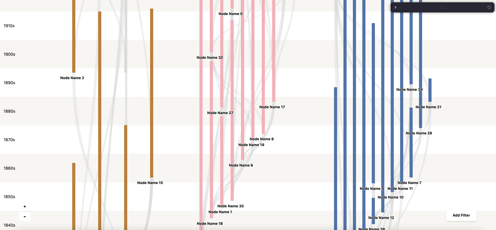
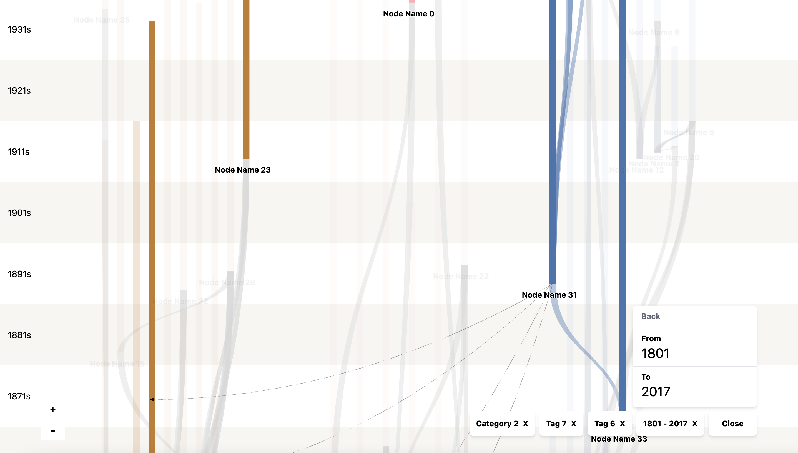
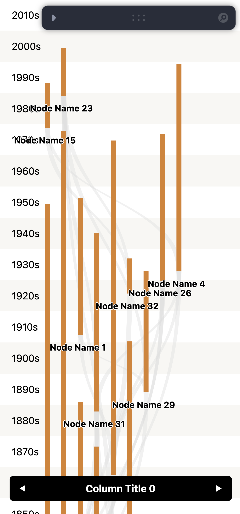
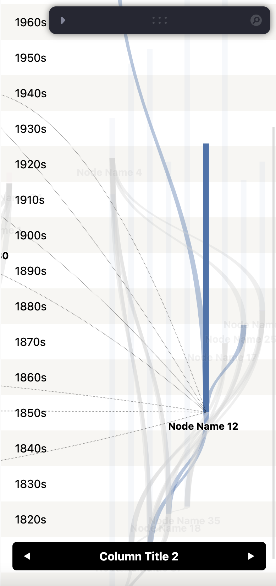

# Timeline-Sankey

A project to visualize time range series data using the [Sankey diagram](https://en.wikipedia.org/wiki/Sankey_diagram).

## Features

- Visualization layout:
  - **Responsive View**, with automatic resizing, and adaptive layout for mobile or desktop devices.
  - **Grid layout** for multiple node series
  - Direct link and cross(series) link
  - Node title
  - Series(column) title in mobile view
- Interactions:
  - Hovering over a node highlights the connected nodes and links
  - **Zoom** on vertical orientation
  - **Filter** by node tags, categories or date range
  - Node clicking redirect
  - **Swipe** and **Touch** on mobile device view

## Preview

[Online Demo](https://timeline-sankey.vercel.app)

You can play with the demo by tweaking any parameters on right side of the page.

#### Desktop View

Interaction on desktop view

#### Mobile View

More preview images can be found in the [preview folder](./preview).

### Docs

This is not a library, but all parameters are exposed as public properties and which can be changed on the demo page. You can also go through the [index.tsx](./src/pages/index.tsx) to see all properties.

### Visualization Algorithm

- Simple calculation of node position witnin each series(grid, column) to make them side by side as much as possible. So it's not a classical Sankey diagram algorithm like [which d3 is using](https://github.com/d3/d3-sankey)
- Connect nodes with links then
- Calculate node properties when interacting or filtering

## LICENSE

[BSD-3-Clause](./LICENSE) © [GeekPlux](https://github.com/geekplux).
